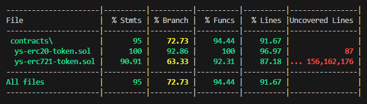

# OTUS - Solidity Developer

## Homework 2: contracts according to the standards ERC20, ERC721

### ERC20:

Deployed and verified contract on Sepolia testnet: [link to YSERC20token](https://sepolia.etherscan.io/token/0x92f4e231163d4e55458a42bef3b8b8c8b7899729#code)

### ERC721:

Deployed and verified contract on Sepolia testnet: [link to YSERC721token](https://sepolia.etherscan.io/token/0x81abe73b25fced4b0556cc98b4b12905b177d28b#code)

### Coverage:

